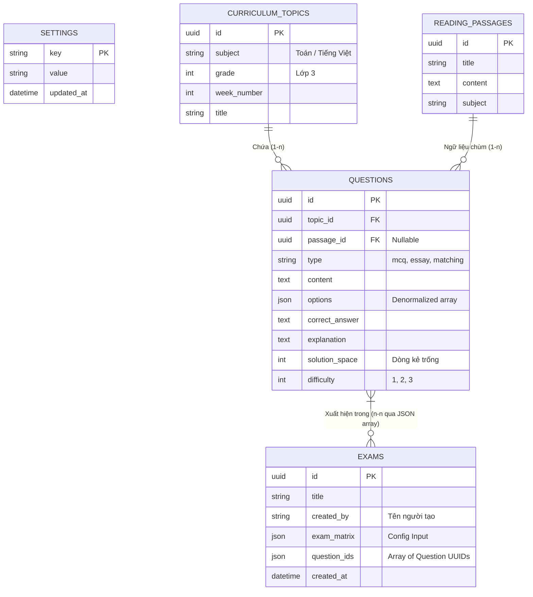

# 4. Thiết kế Cơ Sở Dữ Liệu Chuyên Sâu (Database Architecture)

Cơ sở dữ liệu được thiết kế tối ưu cho mô hình Đọc nhiều (Read-Heavy) lúc sinh đề, xử lý triệt để bài toán Câu hỏi chùm (Passage) và Dữ liệu mảng (JSON Options).

---

## 4.1. Conceptual Model (Sơ đồ ERD)



---

## 4.2. Physical Schema & Rationale (Lược đồ Vật lý & Giải trình)

### 4.2.1. Bảng `questions` (Hạt nhân Hệ thống)
Bảng này áp dụng chiến lược **Denormalization (Phi chuẩn hóa)** một phần thông qua cột `options`.

- **Cột `options` (Kiểu JSON):** Thay vì tạo một bảng `answers` riêng biệt và phải `JOIN` liên tục 4 đáp án cho mỗi 100 câu hỏi, hệ thống lưu thẳng 1 mảng JSON. 
  - Vd (Trắc nghiệm): `["A. Mèo", "B. Chó", "C. Gà"]`.
  - Vd (Nối từ): `[{"left": "Apple", "right": "Táo"}, {"left": "Cat", "right": "Mèo"}]`. 
  - *Lý do:* Tăng tốc x10 lần khi Randomizer Engine bốc câu hỏi.

- **Cột `passage_id` (Ngoại lệ cho Đọc hiểu):** Nếu câu hỏi thuộc dạng Đọc hiểu (Tiếng Việt), nó bắt buộc phải trỏ Foreign Key về `reading_passages.id`. Khi bốc random trúng câu này, hệ thống dùng JOIN để kéo cả đoạn văn gốc lên.

### 4.2.2. Bảng `exams` (Đề kiểm tra)
- **Cột `question_ids` (Kiểu JSON):** Mảng lưu đúng thứ tự UUID của các câu hỏi (Vd: `["uuid-1", "uuid-5", "uuid-2"]`). 
  - *Lý do:* Tờ đề kiểm tra là một Artifact (Bản in) cố định. Không dùng Bảng Mapping (Exam_Question) vì khi người dùng đổi chỗ (Drag Drop) câu 1 xuống câu 3 trên UI, ta chỉ việc swap vị trí phần tử trong mảng JSON rồi Update lại 1 record duy nhất, cực kỳ nhanh.

---

## 4.3. Indexing Strategy (Chiến lược Đánh chỉ mục)

1. **Composite Index cho Randomizer:**
   Thuật toán Randomizer tìm kiếm câu hỏi bằng Môn học + Lớp + Tuần học. Do đó, tạo Composite Index:
   ```sql
   CREATE INDEX idx_questions_topic_diff ON questions (topic_id, difficulty);
   ```

2. **Full-Text Search (FTS5 Virtual Table):**
   Để thanh Search hoạt động Real-time:
   ```sql
   CREATE VIRTUAL TABLE questions_fts USING fts5(content, content='questions', content_rowid='id');
   
   -- Trigger để tự động đồng bộ khi thêm/sửa/xóa câu hỏi
   CREATE TRIGGER tbl_ai AFTER INSERT ON questions BEGIN
     INSERT INTO questions_fts(rowid, content) VALUES (new.id, new.content);
   END;
   ```

---

## 4.4. Data Lifecycle: Orphan Image Management (Dọn Rác)
- **Vấn đề:** Khi xóa 1 câu hỏi có chứa ảnh `/images/abc.png`, ảnh vẫn nằm trên ổ cứng làm đầy dung lượng.
- **Giải pháp (Garbage Collection):** Không xóa ngay. Hàng tháng, Rust Background Worker sẽ chạy hàm quét: Đọc toàn bộ chuỗi `/images/` có trong SQLite, đối chiếu với danh sách file thực tế trên ổ cứng. Xóa bất cứ file nào trên ổ cứng không có mặt trong DB.
