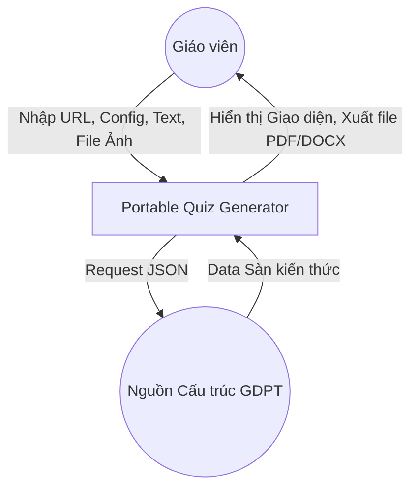
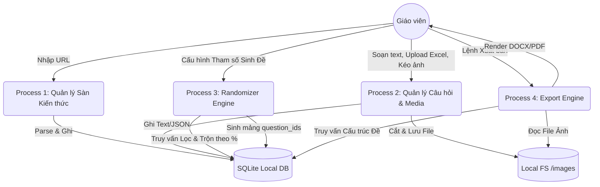

# 5. Thiết Kế Kiến Trúc Hệ Thống (System Architecture Design)

Tài liệu này tập trung vào kiến trúc tổng thể, ranh giới hệ thống, các đối tượng tương tác (Actors) và Sơ đồ luồng dữ liệu (Data Flow Diagrams - DFD).

> [!NOTE]
> Để xem chi tiết các bước thao tác, kịch bản lỗi, và tham số của từng Use Case, vui lòng tham chiếu đến tài liệu **[9_detailed_use_cases.md](9_detailed_use_cases.md)**.

---

## 5.1. Sơ đồ Use Case Tổng thể (Actors & Boundaries)

```mermaid
usecaseDiagram
    actor "Giáo viên (Teacher)" as teacher
    actor "Quản trị viên (Admin)" as admin

    package "Portable Quiz Generator" {
        usecase "UC-01: Tải Template & Import Excel" as UC1
        usecase "UC-02: Soạn câu hỏi Trắc nghiệm" as UC2
        usecase "UC-03: Soạn câu hỏi Tự luận" as UC3
        usecase "UC-04: Soạn câu hỏi Nối từ/Số" as UC4
        
        usecase "UC-05: Sinh Đề Tự động" as UC5
        usecase "UC-06: Sinh Đề Thủ công" as UC6
        usecase "UC-07: Tinh chỉnh Tờ Đề (Interactive)" as UC7
        usecase "UC-08: Xuất file (PDF, DOCX, HTML)" as UC8
        usecase "UC-09: Đồng bộ Sàn Kiến thức" as UC9
    }
    
    admin --> UC1
    admin --> UC9
    
    teacher --> UC1
    teacher --> UC2
    teacher --> UC3
    teacher --> UC4
    teacher --> UC5
    teacher --> UC6
    teacher --> UC7
    teacher --> UC8
```

*(Chi tiết hành vi của các Use Case này được mô tả tại [9_detailed_use_cases.md](9_detailed_use_cases.md))*

---

## 5.2. Sơ đồ Luồng Dữ liệu (Data Flow Diagrams - DFD)

### 5.2.1. DFD Level 0 (Context Diagram)



### 5.2.2. DFD Level 1 (System Processes)



### 5.2.3. DFD Level 2 (Chi tiết Process 3: Randomizer Logic)

```mermaid
graph TD
    Config[Exam Matrix Config: Subject, Week, Difficulty Ratio]
    
    subgraph Rust Core
        R1(Filter 1: Lọc theo Môn, Lớp, Tuần)
        R2(Filter 2: Lọc theo Cấp độ Cơ bản/Nâng cao % Target)
        R3(Check Constraints: Bắt buộc Hình học, Đọc hiểu)
        R4(Shuffle: Fisher-Yates Trộn ngẫu nhiên đáp án và câu hỏi)
        R5(Build: Lắp ráp thành mảng JSON)
    end
    
    DB[(SQLite)]
    
    Config --> R1
    R1 -- Lệnh SELECT --> DB
    DB -- Danh sách ID thô --> R1
    R1 --> R2
    R2 --> R3
    R3 -- Pass --> R4
    R3 -- Fail (Thiếu dữ liệu theo Ratios) --> R5_Error(Trả về AppError)
    R4 --> R5
    R5 --> DB(Lưu vào bảng EXAMS)
```



---

## 5.3. Quyết định Kiến trúc Bổ sung (Resilience & Security)
- **Single Source of Truth:** Mọi luồng dữ liệu đều lấy SQLite làm trung tâm. React (Zustand) chỉ là lớp phản chiếu (Mirror).
- **Concurrency (Đồng thời):** Do là app Desktop (Single User), SQLite được cấu hình ở chế độ `WAL` (Write-Ahead Logging) để đảm bảo tốc độ ghi không chặn tốc độ đọc khi Randomizer đang chạy nặng.
- **Path Security:** Rust Tauri giới hạn đặc quyền đọc/ghi. Hệ thống chỉ được cấp quyền thao tác bên trong thư mục cài đặt `QuizApp_Portable` (Scope path), tuyệt đối không được truy cập `C:\Windows` hay các thư mục riêng tư của OS, ngăn chặn lỗ hổng Path Traversal.
